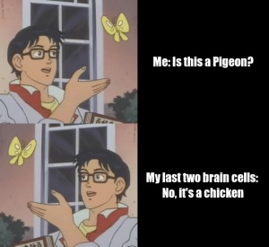
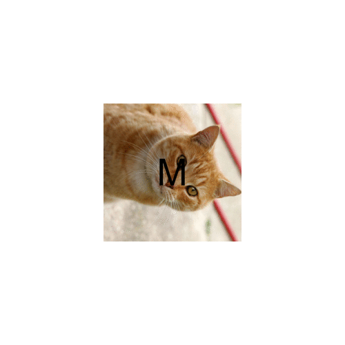

```{r setup, include=FALSE}
knitr::opts_chunk$set(message = FALSE, echo = TRUE)
```

## My meme

My meme represents myself when I do something dumb as I often make silly mistakes.
The motivation of my meme is to show how my brain acts sometimes when doing daily activities.


```{r file='meme.R', eval=FALSE}

```

## My animated GIF

My animated GIF shows a cat rotating 360 degrees and the text "MEOW" forming after each frame.
The motivation of my GIF was to create something I thought was cute so I decided to use an image of a cat as the base of my GIF.


```{r file='animation.R', eval=FALSE}

```

```{css}
@import url('https://fonts.googleapis.com/css2?family=Montserrat:wght@300&family=Mukta:wght@200&display=swap');
p {font-family: 'Montserrat', sans-serif;
}

body {font-family: 'Mukta', sans-serif;
      font-weight: bold;
      background-color: #b0a382;
}
```

