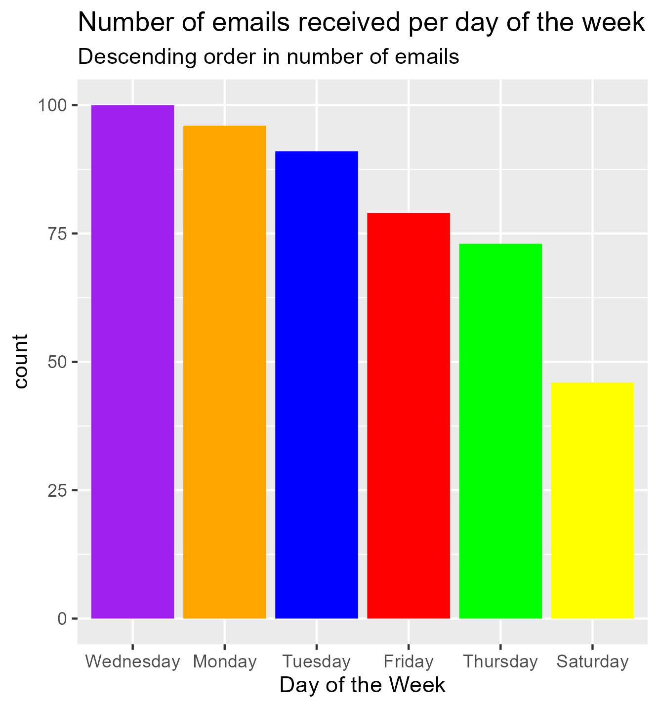
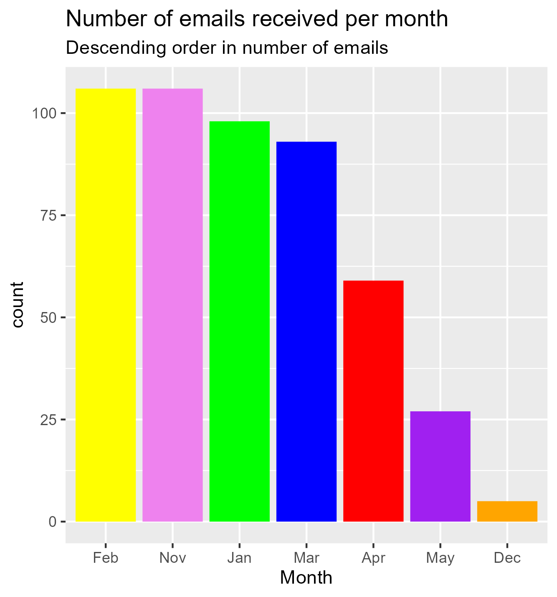
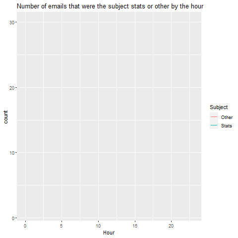

```{r setup, include=FALSE}
knitr::opts_chunk$set(echo = FALSE)
```

## Introduction
I chose to focus on the number of emails I received per day of the week and per month, as well as the subjects of the emails. I decided to look at the email subjects because I am majoring in statistics, and I thought it would be interesting to see how many of my emails were related to my major compared to those that were not. By counting the emails, I wanted to see which days or months had the highest volume of emails and whether my assumptions aligned with the data. For my static visualizations, I used a geom_col() chart, as it best represented my variables and had the most visual appeal. I used my own color palette for the chart, opting for the colors of the rainbow as they are commonly known and suited the theme of the day of the week, which has seven days. Although I experimented with changing the background color of the plot, I ultimately decided that the default color was the best, as it looked the most natural. For my animated plot, I used a geom_line() chart to demonstrate the change in emails received per hour. I used special features of ggplot2 (such as scale_fill_manual and theme) to apply my preferred color scheme to the animated plot and static plots.

## Visualisations


I wanted to determine the day of the week when I received the most emails. From the plot we can see that Wednesday and Monday were the days with the highest number of emails.



I was interested in seeing during which month I receive the most emails. From the plot, we can see that February and November were the months during which I received the most emails. This makes sense as February is near the beginning of the year and November is near the end of the year, meaning there would likely be more emails during those times.




I was curious to see how many of the emails I received during each hour were related to my major of statistics. From the plot, we can see that the trend for statistics and other emails is similar, however, the volume of other emails is greater than that of statistics, resulting in greater peaks for other emails.


## Learning reflection
An important lesson I learned from module 4 is the usefulness of the tools provided by ggplot2 and gganimate for creating plots. I found that features like scale and theme adjustments can greatly enhance the visual appeal of a plot and make it more user-friendly by reducing visual clutter. By improving the aesthetics of a plot, it becomes easier for users to read and interpret the information presented.

In my project, I demonstrated creativity by creating my own color palette instead of using the default colors provided by R. I chose a rainbow color scheme that is both visually appealing and suitable for the theme of the days of the week. Additionally, I added custom CSS to my code to make my HTML file more consistent with the overall theme of my project.

Moving forward, I am excited to explore more types of plots that can be animated in R. I believe that animated plots can convey a more engaging story and present data in a more approachable manner than static plots. Expanding my knowledge of the animate function will be particularly useful as a statistics major.

## Appendix
```{r file='exploration.R', eval=FALSE, echo=TRUE}

```

```{css}
@import url('https://fonts.googleapis.com/css2?family=Montserrat:wght@300&family=Mukta:wght@200&display=swap');
p {font-family: 'Montserrat', sans-serif;
}

body {font-family: 'Mukta', sans-serif;
      font-weight: bold;
      background-color: #DCDCDC;
}
```