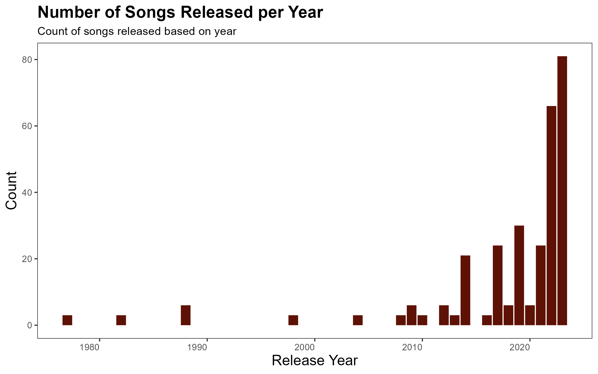
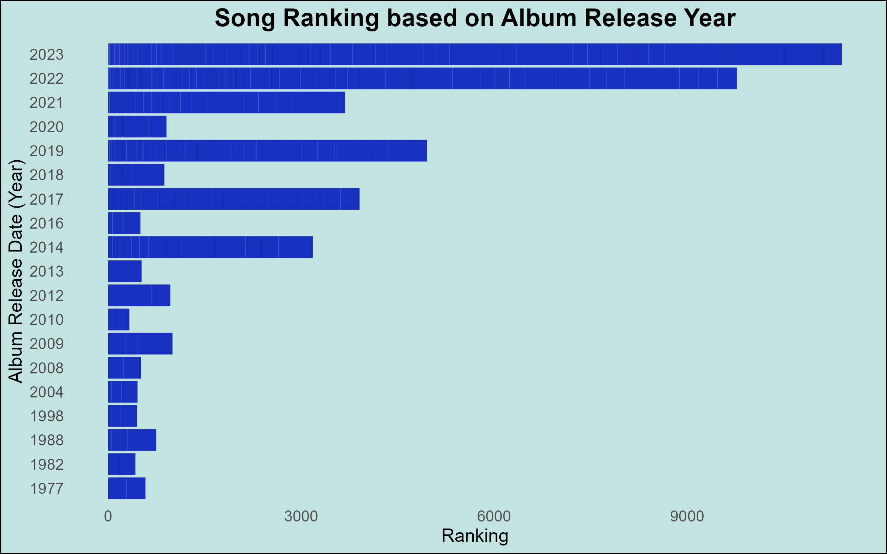

```{r setup, include=FALSE}
knitr::opts_chunk$set(echo = FALSE, message = FALSE, warning = FALSE)
```

## Introduction

I chose New Zealand as the first country for analysis because it is my home country, and I wanted to explore its music scene. For the other two countries, the United States and the United Kingdom, I selected them based on their large user base on Apple Music. These countries have a significant number of Apple Music users and are English-speaking nations, which aligns well with Apple being an American company and English being the dominant language in the US. By focusing on these countries, I aimed to gain insights into the years that produced the most music.
To analyze the songs that appear in both playlists, I would utilize SQL queries. Firstly, I would select the relevant playlists and identify the common columns between them. Then, using the JOIN function, I can combine the playlists based on these shared columns to identify the songs that are present in both. 
```
SELECT DISTINCT playlist1.song_id, playlist1.song_name
FROM playlist1
JOIN playlist2 ON playlist1.song_id = playlist2.song_id;
```
The distinct function only chooses unique songs from both playlists. This approach allows for a comprehensive understanding of the overlapping songs across the playlists.


## Data creations


The plot I created illustrates the annual distribution of released songs. I chose to focus on this aspect as I was curious to explore which years have been particularly prolific in terms of new music. Upon analyzing the plot, it becomes evident that the more recent years tend to exhibit a higher number of song releases. This observation can be attributed to the emergence of new artists and the subsequent influx of fresh music into the industry. The trend suggests that contemporary times witness a surge in musical output, likely driven by a growing number of artists contributing to the vibrant music landscape.


I created another plot using the knowledge I learnt from all the previous projects. The techniques used in the plot were from all the different labs we had and from all the lectures. This plot mainly uses the ggplot2 package which was a package we learnt near the start of the semester and was used in project 2.


## Final reflection

I gained valuable insights and skills through web scraping in Module 5 of this course. While I was already familiar with inspecting elements, I had not previously applied this knowledge in R. However, thanks to the rvest package, I discovered powerful methods to extract information from HTML sources. Additionally, by leveraging the capabilities of the stringr package, I acquired the ability to efficiently extract and manipulate specific data elements as desired. The combination of these tools has significantly expanded my repertoire and equipped me with valuable techniques for web scraping in R.

After completing this project, it will mark the completion of five projects in this course. I find these projects to be immensely valuable as they provide practical applications for the knowledge we have gained through the labs. This hands-on approach allows us to truly utilize and apply the concepts we have learned. Throughout these projects, my proficiency in R has significantly improved. I am now able to create more polished and professional static plots, while also becoming more adept at manipulating complex datasets. However, I am still intrigued by the challenges posed by data sets with numerous variables. I am curious and want to explore advanced techniques for data manipulation, ensuring that the plots I create are visually appealing and easy to interpret, even when dealing with large amounts of information.

## Appendix
```{r file='song_web.R', eval=FALSE, echo=TRUE}

```
```{r file='album_web.R', eval=FALSE, echo=TRUE}

```
```{r file='data_creativity.R', eval=FALSE, echo=TRUE}

```

```{css}
@import url('https://fonts.googleapis.com/css2?family=Montserrat:wght@300&family=Mukta:wght@200&display=swap');
p {font-family: 'Montserrat', sans-serif;
}

body {font-family: 'Mukta', sans-serif;
      font-weight: bold;
      background-color: #f7f3e9;
}
```

## Redemption
### Creativity project 4
I added something beyond what is needed for the project such as a new function in the HTML output. 
```
html_document:
    theme: paper
```

This is demonstrating creativity as it has not been covered in the labs or lectures and I used it in this project for what I missed out on in project 4.


